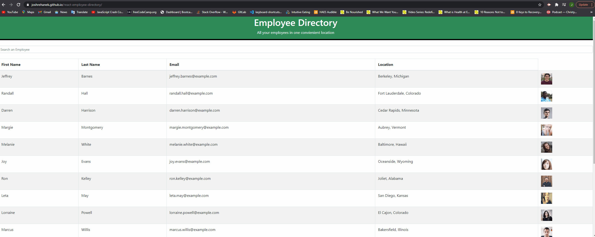

# react-employee-directory
This is a employee directory created with React JS. This application's UI is broken up into components. Component state is then managed and responds to user events. Users can search for Employee's within the directory by first & last name, as well as 

## Table of contents
- [Deployed App](#deployed)
- [Link to GitHub Repo](#link-to-github-repo)
- [Demo](#demo)
- [Technologies](#technologies)
- [Summary](#summary)
- [Author](#author)

## Deployed App
- https://joshrehanek.github.io/react-employee-directory/

## Link to GitHub Repo
- https://github.com/joshrehanek/react-employee-directory

## Demo
- 

## Technologies
- [node.js](https://nodejs.org/en//)
- [npm](https://www.npmjs.com/)
- [mongoose](https://mongoosejs.com/docs/)
- [express](https://expressjs.com/)
- [morgan](https://www.npmjs.com/package/morgan)
- [compression](https://www.npmjs.com/package/compression)
- [lite-server](https://www.npmjs.com/package/lite-server)

## Summary

- This is a employee directory created with React JS. This application's UI is broken up into components. Component state is then managed and responds to user events. Users can search for Employee's within the directory by first & last name, as well as 

## Author
- Joshua Azzam Rehanek
